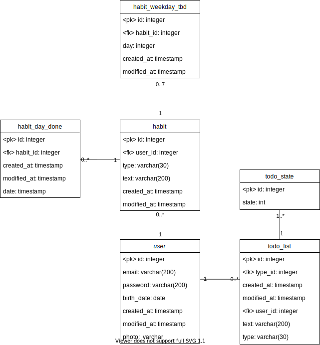

# Productivity-App-Backend

Github link: https://github.com/mfranczel/Productivity-App-Backend

## Spustenie

Docker:

```console
foo@bar:~$ docker-compose build
foo@bar:~$ docker-compose up
```

## Zmeny

### Backendové testy

- Pri teste 2 (Zmena používateľských údajov) mením email namiesto hesla kvôli tomu, že sa nedá zo servera retrievnúť. Je zmenený na mail bez @, čo by taktiež malo zamietnuť.

### API

- Niektoré zmenené a pridané nové response kódy, zväčša len 500 v prípade chyby na strane servera
- Pri /habit/get zmenený response body, pred tým bol zjednodušený, teraz napísaný v celej svojej kráse - array objektov, z ktorých každý má dve ďalšie arraye objektov
- Pri /habit/get bol odstránený path parameter s používateľským ID - získavame ho vždy z tokenu
- Pridané summary pri requestoch kvôli prehľadnosti

### Databázový model
- Pri databázovom diagrame pridané created_at, modified_at (sequelize), typ pri habit zmenený na enum v sequelize (v diagrame string)


## Dátový model


## Dokumentacia
https://documenter.getpostman.com/view/10555291/TzCP77Dq
